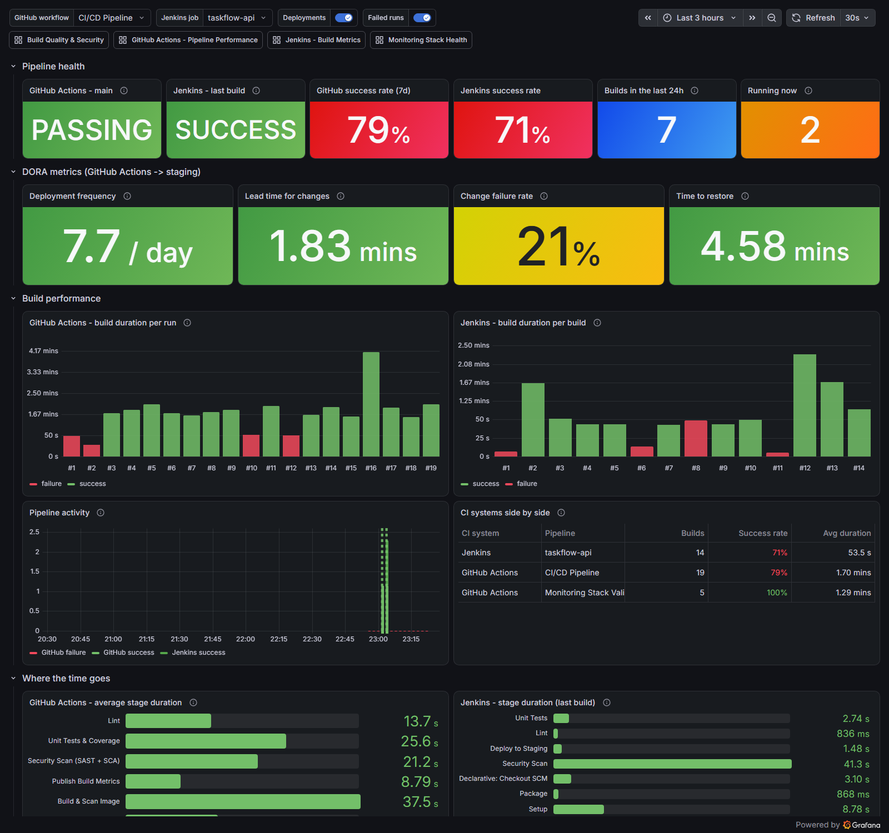
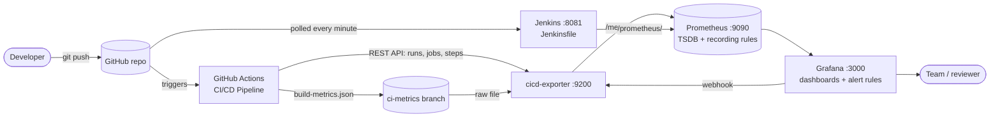

# Monitoring CI/CD Pipeline Performance and Build Metrics with Grafana

[](https://github.com/AmbujKRai/grafana-cicd-monitoring/actions/workflows/ci-cd.yml)
[](https://github.com/AmbujKRai/grafana-cicd-monitoring/actions/workflows/monitoring-stack.yml)

A working DevOps case study that uses **Grafana** to monitor the performance and quality of CI/CD
pipelines. A sample service (TaskFlow API) is built by two CI systems, **GitHub Actions** (cloud) and
**Jenkins** (self-hosted). Their build metrics are collected by **Prometheus** and shown in
provisioned Grafana dashboards with **DORA metrics** and **alerting**. All of it is configured from
files in this repository: pipelines, monitoring stack, dashboards and alert rules.



## Architecture



| Component | Role |
|---|---|
| `app/`, `tests/` | TaskFlow API (Flask) with 27 unit tests: the code the pipelines build |
| `.github/workflows/ci-cd.yml` | Lint → Unit tests + coverage gate → Security scan (Bandit SAST, pip-audit SCA) → Docker build + Trivy scan + push to GHCR → Deploy to an ephemeral staging environment + smoke test → Publish build metrics |
| `Jenkinsfile`, `monitoring/jenkins/` | The same pipeline on a local Jenkins, configured as code (JCasC + Job DSL) |
| `monitoring/exporter/` | **cicd-exporter**: turns GitHub Actions runs, jobs and steps plus the published build metrics into Prometheus metrics. Also receives Grafana alert webhooks |
| `monitoring/prometheus/` | Scrape config and recording rules that normalise both CI systems into `ci:*` series |
| `monitoring/grafana/` | Provisioned data source, 5 dashboards, 12 alert rules, contact point and notification policy |
| `docker-compose.yml` | The whole monitoring stack for Docker users (tested in CI by `monitoring-stack.yml`) |
| `scripts/` | Windows setup/start/stop/status scripts (no Docker needed), dashboard generator, checks |

## Dashboards

| Dashboard | What it answers |
|---|---|
| **CI/CD Pipeline Overview** | Are the pipelines green? DORA metrics (deployment frequency, lead time, change failure rate, time to restore), duration per run in both CI systems, GitHub Actions and Jenkins side by side |
| **GitHub Actions – Pipeline Performance** | Success rate, average and p95 duration, runner wait, stage breakdown per run, slowest steps, failures by stage, recent runs linked to GitHub |
| **Build Quality & Security** | Tests, coverage, lint, Trivy CVEs by severity, Bandit / pip-audit findings, quality-gate status, image size and smoke-test latency, with per-run trends |
| **Jenkins – Build Metrics** | Last build result, duration and queue wait per build, stage timings, tests, executors |
| **Monitoring Stack Health** | Scrape targets, exporter polling, GitHub API quota, alert notifications (who monitors the monitor?) |

## Quick start

### Windows (no Docker)

Requirements: Python 3.11+, Git, Java 21 (only for Jenkins).

```powershell
git clone https://github.com/AmbujKRai/grafana-cicd-monitoring.git
cd grafana-cicd-monitoring
powershell -ExecutionPolicy Bypass -File scripts\setup-windows.ps1   # downloads pinned, checksum-verified Prometheus, Grafana, Jenkins
powershell -ExecutionPolicy Bypass -File scripts\start-stack.ps1     # starts exporter, Prometheus, Grafana, Jenkins
powershell -ExecutionPolicy Bypass -File scripts\status.ps1          # health report
```

| URL | |
|---|---|
| http://localhost:3000 | Grafana (dashboards are readable without login; `admin` / password from `.env` to edit) |
| http://localhost:9090 | Prometheus |
| http://localhost:9200 | cicd-exporter (`/metrics`, `/healthz`, `/alerts`) |
| http://localhost:8081 | Jenkins (job `taskflow-api`) |

Stop everything with `scripts\stop-stack.ps1` (data in `.data\` is kept). Without a token the exporter
uses the public GitHub API (60 requests/hour) and slows its polling down to fit. Put a read-only token in
`.env` (`GITHUB_TOKEN=`) or start with `-UseGhToken` to poll every 15 seconds.

### Docker

```bash
echo "GITHUB_REPOSITORY=AmbujKRai/grafana-cicd-monitoring" > .env
docker compose up -d --build
```

## Exporter metrics

| Metric | Type | Labels | Meaning |
|---|---|---|---|
| `cicd_workflow_runs_total` | counter | workflow, branch, event, conclusion | Completed runs |
| `cicd_workflow_run_duration_seconds` | histogram | workflow | Run duration (for percentiles) |
| `cicd_workflow_runs_window` | gauge | workflow, window, conclusion | Runs per outcome in the last 24h / 7d / 30d |
| `cicd_workflow_duration_window_seconds` | gauge | workflow, window, stat | avg / p50 / p95 / max duration per window |
| `cicd_workflow_last_run_status` | gauge | workflow, branch | 1 = latest run succeeded, 0 = failed |
| `cicd_workflow_runs_active` | gauge | workflow, status | Runs queued or in progress |
| `cicd_run_duration_seconds`, `cicd_run_wait_seconds` | gauge | run_number, conclusion, commit, title, … | One series per recent run |
| `cicd_run_stage_duration_seconds` | gauge | workflow, run_number, stage | Stage (job) duration per run |
| `cicd_stage_duration_seconds`, `cicd_stage_queue_seconds` | histogram | workflow, stage | Stage duration and runner wait |
| `cicd_stage_runs_total` | counter | workflow, stage, conclusion | Stage outcomes (which stage fails most) |
| `cicd_step_duration_seconds` | gauge | workflow, stage, step | Steps of the latest run (bottlenecks) |
| `cicd_dora_deployment_frequency_per_day` | gauge | environment | Successful deployments per day (7 days) |
| `cicd_dora_lead_time_for_changes_seconds` | gauge | environment | Median commit → deployment time |
| `cicd_dora_change_failure_rate_ratio` | gauge | workflow | Failed share of main-branch runs (7 days) |
| `cicd_dora_time_to_restore_seconds` | gauge | workflow | Mean time from a red to the next green main build |
| `cicd_build_tests`, `cicd_build_coverage_ratio`, `cicd_build_vulnerabilities`, `cicd_build_quality_gate`, `cicd_build_image_size_bytes` | gauge | workflow, … | Build quality of the latest run (from the `ci-metrics` branch) |
| `cicd_github_api_rate_limit_remaining`, `cicd_exporter_last_poll_timestamp_seconds` | gauge | | Exporter health |

Jenkins metrics come from the [Prometheus metrics plugin](https://plugins.jenkins.io/prometheus/)
(`default_jenkins_builds_*`, `default_jenkins_executors_*`).

## Alert rules

| Rule | Severity | Fires when |
|---|---|---|
| Pipeline failing on main (GitHub Actions) | critical | latest main run failed |
| Jenkins build failing | critical | last Jenkins build result is FAILURE |
| Low pipeline success rate (7 days) | warning | success rate < 80 % |
| Build time regression | warning | last main run > 1.5 × 7-day median duration |
| Runs waiting for runners / Jenkins build queue backlog | warning | work queued for more than 5 minutes |
| Security gate failed | critical | Bandit HIGH finding, vulnerable dependency or fixable CRITICAL CVE |
| Quality gate failed (tests / coverage) | warning | failing tests or coverage < 80 % |
| CI/CD exporter down, Jenkins down, GitHub API quota low, Exporter not polling GitHub | critical / warning | monitoring stack problems |

Notifications go to the exporter's `/alerts` webhook, which logs them in `.data/exporter/alerts.log`
and counts them in `cicd_alert_notifications_total`. To get real notifications, add an email, Slack or
Teams receiver in `monitoring/grafana/provisioning/alerting/contact-points.yml`.

## Demo scenarios

| Scenario | How | What Grafana shows |
|---|---|---|
| Healthy build | push any change | green run, stage breakdown, deployment counted in DORA |
| Broken test | push a change that fails a unit test | red bars in both CI systems, *Pipeline failing* and *Jenkins build failing* alerts, change failure rate goes up |
| Recovery | push the fix | alerts resolve, *time to restore* is computed |
| Vulnerable dependency | add an old library version to `requirements.txt` | security stage fails, `sca` gate FAIL, *Security gate failed* alert |
| Slow build | *Run workflow* with `simulate_slow_build` (Actions) or `SIMULATE_SLOW_BUILD` (Jenkins) | longer bar in the stage breakdown, *Build time regression* alert |

## Security notes

- GitHub Actions are pinned to commit SHAs, permissions are least-privilege per job, and Trivy is
  installed from a pinned release with a checksum check. This follows the March 2026 `trivy-action`
  tag-hijack incident, in which mutable action tags were moved to malicious commits.
- Every local service binds to `127.0.0.1`. Jenkins runs without authentication and Grafana allows
  anonymous **read-only** access. Both are fine for a local demo but must be secured in any shared
  setup (SSO/matrix-auth, `useAuthenticatedEndpoint`, no anonymous access).
- The exporter needs no credentials for public repositories. Tokens live only in the git-ignored `.env`.
- Dependabot keeps pip, Docker and Actions dependencies up to date.

## Development

```powershell
scripts\check.ps1                          # lint + tests + dashboards up to date (same checks as CI)
.venv\Scripts\python scripts\build_dashboards.py   # regenerate dashboards after editing the generator
```

## License

MIT
